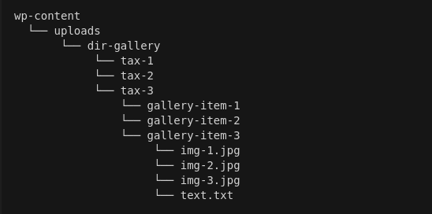

# WP Migrate Gallery

## 1. Steps to Import Gallery

### 1.1. Install ACF PRO
### 1.2. Create CPT Gallery
### 1.3. Create Gallery Taxomy
### 1.4. Copy Gallery media files to project. This directory should have the following structure:

  

### 1.5. Synchronized ACF JSON Custom Fields
### 1.6. Fill in the information from the next point:

- CPT Gallery Slug

- Title for CPT single page

- Gallery Taxonomy Slug

- Gallery DIR: wp-content/

- <button>Save</button>

### 1.7. When all of the above is done, the checkboxes will be checked:
- ACF PRO plugin exists

- CPT Gallery exists

- Gallery Taxonomy exists

- Gallery DIR exists
- <button>Run</button>

 

## 2. Steps to Parse Images
### 2.1. Fill in the information from the next point:
- Site URL

- Parser option

- Container selector 

- Dir title by attribute

- Image wrapper selector

- Subdirectory title

- <button>Save</button>

### 2.2. When all of the above is done, the checkbox will be checked:

- <button>Run Parser</button>